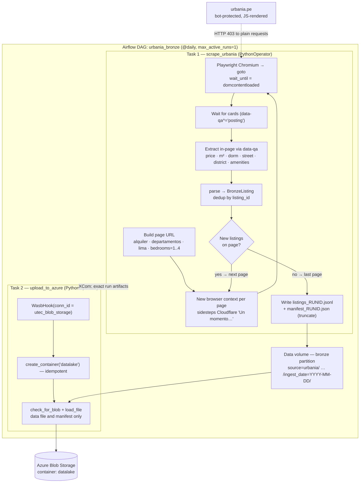

# urbania.pe rental scraper — bronze layer

Scrapes apartment rental listings from [urbania.pe](https://urbania.pe) and lands
them as **raw JSON Lines** in a partitioned layout, ready for an Apache Airflow
DAG to sync to **Azure Blob Storage**. This is the **bronze layer** of a data
pipeline: data is kept raw / minimally transformed; cleaning and numeric
normalization belong to a later silver layer.

## Project brief — First release (G1)

**Category:** Real Estate.

### The problem we want to solve

Lima's apartment rental market is **opaque and has no public, queryable history**.
Prices, availability, and amenities live inside `urbania.pe`, a JavaScript-rendered,
bot-protected portal with **no public listings API**. A renter, analyst, or
investor who wants to answer simple questions — *What is a fair rent for a 1-4 bedroom
in San Isidro? How is price-per-m² evolving by district? Is supply growing or
shrinking?* — has nowhere to get clean, structured, time-stamped data.

> **Proposed problem statement:** *Build an automated, reproducible daily snapshot
> of the 1-4 bedroom apartment rental market in Lima, so that price levels, price per
> m², and supply by district can be analyzed and tracked over time — turning data
> that is today trapped behind a bot-protected portal into a governed data asset.*

This is a starting hypothesis and can be re-scoped (e.g. other cities, `venta`
instead of `alquiler`, or more bedroom counts) without changing the architecture.

### Why automating this loading matters

- **The signal is the history.** A single scrape is a photo; the value is the
  *time series*. Only a scheduled, hands-off job builds that history reliably.
- **The source is hostile and fragile.** Plain HTTP gets `403`; the page never
  reaches `networkidle`; Cloudflare throws an interstitial on rapid navigation.
  Doing this by hand is error-prone and not repeatable — automation encodes the
  hard-won workarounds once and replays them every day.
- **Reproducibility & lineage.** Every run is partitioned by `ingest_date` and
  carries a manifest (counts, params, timings, status), so any snapshot can be
  audited and re-derived. Manual downloads have none of that.
- **It frees people for analysis, not collection.** The team spends time on
  questions, not on babysitting a browser.

### Goals of this first release

1. A working, idempotent **Airflow DAG** that scrapes and lands data unattended.
2. Land **raw listings** in a partitioned **bronze** layout in **Azure Blob Storage**.
3. **Lose nothing:** keep every value as the original string; defer parsing.
4. Be **resilient** to the site's bot protection and **polite** (throttled, retried).
5. **Verifiable** end-to-end: one command brings up Airflow, one run produces files
   in the lake plus a manifest. *(Verified: a run produced **1,141 listings** across
   **42 pages** in ~3 min — see [Is the DAG running correctly?](#is-the-dag-running-correctly).)*

### Scope (raw zone only — no transformation)

In scope (this release):

- Navigation + DOM extraction of search-result cards (`PROPERTY` and `DEVELOPMENT`).
- Writing **NDJSON + a run manifest** in Hive-style partitions.
- A 2-task Airflow DAG that **scrapes** and **uploads to Azure**, on a daily schedule.

Explicitly **out of scope** (left for silver/gold):

- Parsing `"S/ 2,750"` / `"45 a 60 m²"` / `"1 a 2 dorm."` into typed numerics.
- Currency normalization, deduplication across days, geocoding, enrichment.
- Aggregations, dashboards, or models.

> Bronze keeps data raw on purpose: if we discover a parsing bug later, we re-run
> silver over bronze instead of re-scraping the (hostile) source.

### Conceptual architecture

```
   urbania.pe   ───▶   Airflow (DAG)   ───▶   Data lake (Azure Blob, bronze)
  data source        orchestrator                 storage
```

(The detailed task-level diagram is in [Architecture](#architecture) below.)

| Layer | Component | Why this choice |
|-------|-----------|-----------------|
| **Data source** | `urbania.pe`, driven via **Playwright (Chromium)** | The site has no usable listings API, returns `403` to plain requests, and renders server-side into the DOM with stable `data-qa` markers. A real browser is the only reliable way in; Playwright gives async control, a realistic browser context (`es-PE`, `America/Lima`), and fresh contexts per page to dodge the Cloudflare challenge. |
| **Orchestrator** | **Apache Airflow** (CeleryExecutor + Postgres + Redis, via Docker Compose) | Gives scheduling, **retries with backoff**, XCom hand-off between tasks, logging/observability, and a UI — all of which a cron script would force us to reinvent. The official image extends cleanly to bundle Chromium + the scraper. |
| **Storage** | **Azure Blob Storage** (container `airflow`) | Cheap, durable object storage that is the natural landing zone for a lake. The on-disk **Hive-style partition path maps 1:1 to the blob path**, so the upload is a straight mirror and the layout is query-ready for Synapse / Databricks / Fabric later. |

### Tasks in the DAG (`urbania_bronze`)

```
scrape_urbania[1..4]  ──(XCom: run artifacts)──▶  upload_to_azure[1..4]
```

1. **`scrape_urbania`** (`PythonOperator`) — runs the Playwright scraper for
   `alquiler · departamentos · lima · bedrooms=1..4`, with one dynamically mapped
   task per bedroom segment, paginating until a page yields no
   new listings; writes `listings_<run_id>.jsonl` + `manifest_<run_id>.json` to the
   raw partition; returns the exact data and manifest paths via **XCom**.
2. **`upload_to_azure`** (`PythonOperator`) — uses `WasbHook` (Airflow connection
   `utec_blob_storage`, **no secrets in code**), ensures the `datalake` container
   exists, and uploads exactly the two artifacts from its mapped scrape task. Existing
   blobs are skipped to keep the raw zone immutable.

### How often does it run?

`schedule="@daily"`, `start_date=2026-06-01`, `catchup=False`,
`max_active_runs=1` (no two runs ever write the same partition concurrently).
Each DAG run produces four dated segment snapshots. `max_active_tasks=1` processes
them sequentially to avoid sending concurrent browser traffic to the source. The DAG
can also be triggered manually from the UI.

### Errors considered & handled

| Failure mode | Handling |
|--------------|----------|
| `403` / Cloudflare *"Un momento…"* interstitial | **Fresh browser context per page** + realistic UA/locale/timezone; detected challenges retried with **exponential backoff** (`max_retries=3`). |
| Page never reaches `networkidle` | Navigate with `domcontentloaded`, then **poll up to ~20s** for result cards. |
| Navigation timeout | `nav_timeout_ms=45000` + per-page retries. |
| Empty page vs. bot block | Inspect the page title to tell a **genuine last page** (stop) from a **challenge** (retry). |
| Missing / inconsistent card fields | Every model field is **optional**; `PROPERTY` vs `DEVELOPMENT` both tolerated — a missing field never crashes a run. |
| Duplicate listings across pages | **Dedup by `listing_id`** (falls back to URL / raw hash). |
| Task crash / transient error | Airflow `retries=2`, `retry_delay=5min`. |
| Re-run / double-dispatch of same `run_id` | NDJSON file opened in **truncate mode** → rewritten cleanly, no appended duplicates (**idempotent**). |
| Azure container absent | `create_container()` is idempotent (no-op if present). |
| Airflow task retry | A stable run ID derived from the Airflow run and bedroom segment reuses the same local artifact names. |
| Blob already uploaded | `check_for_blob()` skips the existing immutable object instead of overwriting it. |

> In the verified run, `upload_to_azure` succeeded on its **3rd attempt** — proof
> that Airflow's retry policy absorbs transient Azure connection errors as designed.

### Is the DAG running correctly?

**Yes.** A manual run on **2026-06-03** completed both tasks successfully:

- `scrape_urbania`: **42 pages**, **1,141 listings**, ~3 min, `status="success"`.
- `upload_to_azure`: *"Uploaded 2 files to Azure container 'datalake'."*

Manifest shape for a bedroom segment:

```json
{
  "run_id": "scheduled__2026-07-13T05_00_00_00_00_b1",
  "status": "success",
  "records_written": 1141,
  "pages_scraped": 42,
  "started_at": "2026-07-13T05:00:00+00:00",
  "completed_at": "2026-07-13T05:03:01+00:00",
  "search_params": {"bedrooms": 1},
  "data_file": "listings_scheduled__2026-07-13T05_00_00_00_00_b1.jsonl",
  "partition": "source=urbania/operation=alquiler/property=departamento/bedrooms=1/ingest_date=2026-07-13",
  "error": null
}
```

> **Screenshots (optional):** drop them in `docs/img/` and they'll render here.
>
> 
> 

### Outputs generated in the Raw zone

Per run, two files land in the dated partition (and are mirrored to the Azure
container at the same path):

```
.../source=urbania/operation=alquiler/property=departamento/bedrooms=1/ingest_date=2026-06-03/
    listings_<run_id>.jsonl    # one raw listing per line (NDJSON)
    manifest_<run_id>.json     # run stats: counts, params, timings, status
```

Each NDJSON record keeps listing fields as **raw strings** (`price_raw`,
`area_raw`, `bedrooms_raw`, …) plus `_`-prefixed **ingestion metadata**
(`_ingested_at`, `_run_id`, `_source_url`, `_page_num`, `_search_params`, `_raw`).
See [Record fields](#record-fields) for the full schema.

### The most difficult part

**Getting past the site's bot protection without an API.** Three problems stacked:
plain requests return `403`; the page never reaches `networkidle` (constant
analytics/ads/websocket traffic); and Cloudflare serves an *"Un momento…"*
interstitial whenever the *same* browser context re-navigates quickly. Standard
scraping recipes all failed in a different way.

### What we learned solving it

- **How modern anti-bot actually behaves** — and that a *fresh browser context per
  page* (plus realistic locale/timezone/UA and optional stealth) reliably sidesteps
  the challenge where one long-lived context does not.
- **Navigate on `domcontentloaded` and poll for the data you want**, instead of
  waiting on lifecycle events that never fire.
- **Bronze-layer discipline:** preserve raw strings + lineage now, normalize later —
  cheaper and safer than re-scraping a hostile source.
- **Design for idempotency:** truncate-mode writes + `max_active_runs=1` + dedup mean
  retries and re-runs are safe; Airflow's retry policy then absorbs flaky uploads.
- **Hive partitioning that maps 1:1 to blob paths** makes the lake landing trivial
  and query-ready downstream.

## Next steps toward the final project

### How this connects to the future Data Product

Bronze is the foundation. The path to a product is **bronze → silver → gold →
serving**: scheduled transformations (dbt / Spark) read the raw partitions, clean
and type them into silver, aggregate them into gold marts in a warehouse
(Synapse / Databricks / Microsoft Fabric), and expose those via a **BI dashboard**
(market monitor) and/or a **rent-estimation model/API**. Because bronze is immutable
and dated, every downstream table is reproducible and auditable from the lake.

### Tables that might emerge in Silver / Gold

**Silver (cleaned, typed, deduplicated):**

- `listings_clean` — one typed row per listing per `ingest_date`: `price_pen`,
  `currency`, `area_m2_min/max`, `bedrooms_min/max`, `bathrooms`, `district`, `city`,
  `is_development`, parsed from the raw strings.
- `listings_history` — slowly-changing dimension tracking each listing's
  price/availability across days (appeared / disappeared / changed).
- `dim_district` — district reference (and later geocoding/coordinates).

**Gold (analytics-ready marts):**

- `fct_market_daily` — district × date: median rent, **median price per m²**,
  active-listing count, new vs. removed listings.
- `fct_listing_price_history` — per-listing price trajectory for churn/discount analysis.
- `agg_amenity_premium` — rent uplift associated with amenities (gym, pool, …).
- `dim_district` / `dim_amenity` — conformed dimensions feeding the dashboard & model.

## Architecture



## How it works

The site has bot protection (plain HTTP requests get **HTTP 403**) and renders
results **server-side into the DOM** with stable `data-qa` markers — there is no
usable listings JSON API (only third-party analytics XHRs). So the scraper drives
a real **Chromium** browser via Playwright, navigates with `domcontentloaded`
(the page never reaches `networkidle`), waits for the result cards, and extracts
each card in-page.

Two card types are handled:

- **PROPERTY** — a single unit (e.g. `59 m² tot. · 2 dorm. · 1 baño`)
- **DEVELOPMENT** — a project with ranges (e.g. `160 un. · 1 a 2 dorm. · 45 a 60 m²`)

## Setup

```bash
uv sync
uv run playwright install chromium
```

## Usage

```bash
# scrape one page (smoke test)
uv run python main.py --bedrooms 2 --max-pages 1

# scrape all pages of one Lima rental segment (Airflow maps 1-4 automatically)
uv run python main.py --operation alquiler --property departamentos --location lima --bedrooms 2

# watch the browser (debugging)
uv run python main.py --bedrooms 2 --max-pages 1 --no-headless
```

Flags: `--operation` (alquiler|venta), `--property`, `--location`, `--bedrooms`,
`--max-pages` (0 = all), `--no-headless`.

## Output layout (bronze)

Hive-style partitioning that maps 1:1 to an Azure Blob container path:

```
data/bronze/source=urbania/operation=alquiler/property=departamento/
    bedrooms=1|2|3|4/ingest_date=YYYY-MM-DD/
        listings_<run_id>.jsonl     # one JSON record per line
        manifest_<run_id>.json      # run stats (counts, params, timings, status)
```

### Record fields

Listing fields are kept as **raw strings**; ingestion metadata is `_`-prefixed.

| Field | Example | Notes |
|-------|---------|-------|
| `listing_id` | `150075262` | from `data-id` |
| `listing_type` | `PROPERTY` / `DEVELOPMENT` | |
| `url` | `https://urbania.pe/inmueble/...` | |
| `price_raw` | `S/ 2,000`, `Consultar precio` | |
| `maintenance_raw` | `S/ 120 Mantenimiento` | expensas, when shown |
| `area_raw` | `90`, `40 a 69` | m² (range kept raw) |
| `bedrooms_raw` | `2`, `1 a 2` | |
| `bathrooms_raw` | `1` | |
| `units_raw` | `273` | developments only |
| `street` | `Irma Gamero al 100` | |
| `district` / `city` | `Santiago de Surco` / `Lima` | |
| `features` | `["Gimnasio", "Piscina", ...]` | amenity pills |
| `description`, `image_url`, `publisher` | | |
| `_ingested_at`, `_source_url`, `_page_num`, `_run_id`, `_search_params`, `_extraction_method`, `_raw` | | pipeline metadata; `_raw` keeps the scraped card |

## Project structure

```
src/urbania_scraper/
  config.py    # search params, paths, delays, browser context settings
  models.py    # Pydantic BronzeListing schema
  scraper.py   # Playwright navigation + in-page DOM extraction + pagination
  parse.py     # card dict -> BronzeListing (splits the feature string)
  storage.py   # NDJSON partition writer + run manifest
  cli.py       # argparse entrypoint (also exposed as `urbania-scrape`)
main.py        # thin wrapper -> urbania_scraper.cli:main
dags/urbania_bronze_dag.py   # Airflow DAG (scrape -> Azure upload)
Dockerfile / docker-compose.yaml   # local Airflow cluster (CeleryExecutor)
```

## Airflow + Azure

`dags/urbania_bronze_dag.py` runs two tasks: `scrape_urbania` → `upload_to_azure`.
The `Dockerfile` extends the official Airflow image with this project's deps,
Playwright's Chromium, and the scraper source (`/opt/airflow/src`). DAGs are
mounted from the repo-root `dags/` directory (the compose `./dags` volume).

To run it:

1. Build & start: `docker compose up airflow-init` then `docker compose up -d`.
2. Add an Airflow connection named `utec_blob_storage` (type: Azure Blob
   Storage) with the storage account name + key / SAS / managed identity.
   **No credentials in code.**
3. Unpause the `urbania_bronze` DAG in the UI (http://localhost:8080).

Output lands under the mounted data volume (`RAW_ROOT` in the DAG) and is then
uploaded to the `AZURE_CONTAINER`, preserving the partition path.

## Notes

- Be polite: the scraper sleeps a randomized 2–5s between pages and retries
  navigation failures with backoff. Don't crank concurrency.
- Selectors target stable `data-qa` attributes, but a site redesign could break
  them — re-check `scraper.py`'s `_DOM_EXTRACT_JS` if extraction goes empty.
