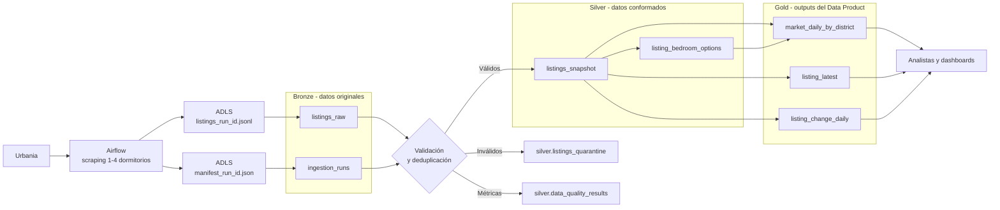

# ETAPA 1: Confirmaciones de descubrimiento y definición del Data Product

Este documento registra las decisiones confirmadas para la ETAPA 1 del proyecto Data Mesh + Medallion.

## Estado de avance

| Paso | Decisión | Estado |
|---|---|---|
| 1 | Identificar el dominio | Confirmado |
| 2 | Identificar la necesidad y las preguntas de negocio | Confirmado |
| 3 | Definir el Data Product | Confirmado |
| 4 | Nombrar el Data Product | Confirmado |
| 5 | Definir inputs y outputs | Confirmado |
| 6 | Diseñar el esquema Medallion | Confirmado |

---

## 1. Dominio confirmado

| Elemento | Definición confirmada |
|---|---|
| Dominio | Comercial e Inteligencia de Mercado |
| Prefijo | `cmc` |
| Responsabilidad | Analizar la oferta, los precios y la evolución del mercado inmobiliario de alquiler |
| Domain Owner propuesto | Responsable de Inteligencia Comercial |
| Technical Owner | Data Engineer del grupo G101 |
| Fuente inicial | Avisos de alquiler extraídos de Urbania |
| Consumidores | Analistas comerciales, inversionistas y dashboards |
| Cobertura | Mercado de alquiler de departamentos en Lima |

### Justificación

Se seleccionó el dominio Comercial e Inteligencia de Mercado debido a que los datos recopilados permiten analizar la oferta, los precios y la evolución del mercado inmobiliario de alquiler. El dominio será responsable de transformar los avisos publicados en fuentes externas en información confiable y reutilizable para analistas y responsables de decisiones comerciales.

---

## 2. Necesidad y preguntas de negocio confirmadas

### Caso de uso

**Análisis del mercado de alquiler de departamentos en Lima.**

| Elemento | Definición confirmada |
|---|---|
| Problema de negocio | No existe información histórica consolidada para comparar precios y oferta de alquiler entre distritos de Lima |
| Pregunta principal | ¿Cómo varían la oferta, el precio de alquiler y el precio por m2 de los departamentos de 1 a 4 dormitorios entre los distritos de Lima y a lo largo del tiempo? |
| Stakeholders | Analistas comerciales, inversionistas y responsables de inteligencia de mercado |
| Frecuencia de ingesta | Diaria |
| Frecuencia de análisis | Semanal o mensual |
| Acción habilitada | Comparar distritos, detectar tendencias y localizar mercados potencialmente atractivos |
| Impacto esperado | Tomar decisiones inmobiliarias basadas en información histórica y comparable |

### Alcance confirmado

| Dimensión | Alcance |
|---|---|
| Operación | Alquiler |
| Tipo de inmueble | Departamentos |
| Ubicación | Lima |
| Dormitorios | 1, 2, 3 y 4 |
| Fuente inicial | Urbania |
| Periodicidad | Snapshot diario |

### Preguntas secundarias

1. ¿Cuántos departamentos de 1, 2, 3 y 4 dormitorios se ofrecen en cada distrito?
2. ¿Cuál es el precio promedio y mediano para cada cantidad de dormitorios?
3. ¿Cuál es el precio por m2 según distrito y número de dormitorios?
4. ¿Cuánto aumenta el precio al pasar de 1 a 2, 3 o 4 dormitorios?
5. ¿Qué combinación de distrito y dormitorios tiene mayor oferta?
6. ¿Dónde existe poca oferta para una cantidad específica de dormitorios?
7. ¿Cómo cambia diariamente la oferta de cada segmento?
8. ¿Qué anuncios aparecen, desaparecen o cambian de precio?

### Indicadores requeridos

- Cantidad de anuncios únicos.
- Precio promedio y mediano.
- Precio mínimo y máximo.
- Precio promedio y mediano por m2.
- Área promedio.
- Variación porcentual del precio.
- Variación de la oferta.
- Cantidad de anuncios nuevos.
- Cantidad de anuncios retirados o no encontrados.
- Días aproximados de permanencia de cada anuncio.

### Dimensiones de análisis

- Fecha.
- Distrito.
- Número de dormitorios.
- Moneda.
- Tipo de anuncio.
- Rango de área.

El grano principal previsto para los indicadores agregados es:

```text
fecha + distrito + dormitorios + moneda
```

### Implicación para el scraping

El proceso de Airflow deberá ejecutar diariamente cuatro configuraciones dentro del mismo DAG:

```text
bedrooms=1
bedrooms=2
bedrooms=3
bedrooms=4
```

La partición esperada en el almacenamiento raw será:

```text
source=urbania/
operation=alquiler/
property=departamento/
bedrooms=1|2|3|4/
ingest_date=YYYY-MM-DD/
```

---

## 3. Data Product confirmado

### Nombre funcional

**Mercado de Alquiler Residencial de Lima**

| Elemento | Definición confirmada |
|---|---|
| Dominio | Comercial e Inteligencia de Mercado |
| Propósito | Entregar información histórica y comparable sobre la oferta y los precios de alquiler |
| Cobertura geográfica | Distritos de Lima disponibles en la fuente |
| Tipo de inmueble | Departamentos |
| Operación | Alquiler |
| Dormitorios | 1, 2, 3 y 4 |
| Actualización | Diaria |
| Consumidores | Analistas comerciales, inversionistas y dashboards |

### Responsabilidades

- Recibir los snapshots diarios de Urbania.
- Conservar la historia de los anuncios.
- Limpiar y normalizar precios, áreas, distritos y dormitorios.
- Evitar duplicados dentro de un mismo snapshot diario.
- Aplicar controles de calidad.
- Publicar indicadores por distrito, fecha y cantidad de dormitorios.
- Informar la fecha de actualización de los datos.
- Mantener trazabilidad hasta el archivo y run de origen.

### Límites confirmados

El Data Product incluye:

- alquiler de departamentos en Lima;
- departamentos de 1 a 4 dormitorios;
- precios, áreas, ubicación y características disponibles;
- evolución temporal de los anuncios.

El Data Product no incluye inicialmente:

- venta de propiedades;
- casas, oficinas o terrenos;
- tasas hipotecarias;
- cálculo de rentabilidad real;
- información demográfica o de seguridad;
- predicción futura de precios.

Los cuatro segmentos de dormitorios pertenecen al mismo Data Product. `bedrooms` será una dimensión analítica, no un producto independiente. Las capas Bronze, Silver y Gold también forman parte del mismo Data Product.

### Definición formal

> El Data Product Mercado de Alquiler Residencial de Lima proporciona información histórica, confiable y reutilizable sobre la oferta y los precios de departamentos de uno a cuatro dormitorios. El producto transforma snapshots diarios obtenidos de portales inmobiliarios en indicadores comparables por distrito, fecha, moneda y número de dormitorios. Está orientado a analistas comerciales e inversionistas que requieren evaluar tendencias y diferencias entre segmentos del mercado.

### Criterios de éxito

1. Consultar la oferta diaria por distrito y dormitorios.
2. Comparar precios de alquiler y precio por m2.
3. Evitar contar varias veces el mismo anuncio durante un día.
4. Identificar anuncios nuevos, retirados o con cambios de precio.
5. Reejecutar el procesamiento sin producir duplicados.
6. Identificar cuándo y desde qué archivo se obtuvo cada registro.

---

## 4. Nombre confirmado

| Recurso | Nombre confirmado |
|---|---|
| Data Product | `cmc_mercado_alquiler` |
| Nombre visible | Mercado de Alquiler Residencial de Lima |
| Catálogo de Unity Catalog | `g101_cmc_mercado_alquiler` |
| Lakeflow Job | `g101_cmc_mercado_alquiler_daily` |
| Grupo administrador | `g101_cmc_mercado_alquiler_admin` |
| Grupo escritor | `g101_cmc_mercado_alquiler_writer` |
| Grupo lector | `g101_cmc_mercado_alquiler_reader` |
| Carpeta de código propuesta | `databricks/cmc_mercado_alquiler/` |

### Convención

```text
<dominio>_<nombre_data_product>
```

El prefijo del grupo se añade a los recursos de Databricks:

```text
g101_<dominio>_<nombre_data_product>
```

Reglas de nomenclatura:

- usar minúsculas;
- separar palabras con `_`;
- no usar tildes, espacios ni caracteres especiales;
- utilizar nombres de tablas en inglés para mantener consistencia con el código;
- utilizar el nombre funcional en español en documentación y presentaciones.

Ejemplos de nombres completos previstos:

```text
g101_cmc_mercado_alquiler.bronze.listings_raw
g101_cmc_mercado_alquiler.silver.listings_snapshot
g101_cmc_mercado_alquiler.gold.market_daily_by_district
```

---

## 5. Inputs y outputs confirmados

### Input 1: anuncios de Urbania

| Elemento | Definición confirmada |
|---|---|
| Nombre lógico | `urbania_listings` |
| Formato | NDJSON |
| Productor | Scraper ejecutado por Airflow |
| Frecuencia | Diaria |
| Operación | Alquiler |
| Tipo de inmueble | Departamento |
| Dormitorios | 1, 2, 3 y 4 |
| Almacenamiento | Azure Data Lake Storage |
| Mutabilidad | Archivos inmutables |
| Clave del anuncio | `listing_id` |
| Clave de observación | `_run_id + listing_id` |

Ruta esperada:

```text
raw/airflow/G1/
└── source=urbania/
    └── operation=alquiler/
        └── property=departamento/
            └── bedrooms=1|2|3|4/
                └── ingest_date=YYYY-MM-DD/
                    └── listings_<run_id>.jsonl
```

Grupos de campos:

| Grupo | Campos |
|---|---|
| Identidad | `listing_id`, `listing_type`, `url` |
| Precio | `price_raw`, `maintenance_raw`, `currency`, `price_min` |
| Características | `area_raw`, `bedrooms_raw`, `bathrooms_raw`, `units_raw` |
| Ubicación | `address_raw`, `street`, `district`, `city` |
| Contenido | `features`, `description`, `publisher`, `image_url` |
| Trazabilidad | `_run_id`, `_ingested_at`, `_source_url`, `_page_num` |
| Búsqueda | `_search_params` |
| Auditoría | `_extraction_method`, `_raw` |

Reglas confirmadas:

- Cada archivo corresponde a un run y segmento de dormitorios.
- Los archivos raw no se sobrescriben.
- `_run_id` debe existir en todos los registros.
- La combinación `_run_id + listing_id` debe ser única.
- `_search_params.bedrooms` debe coincidir con la partición `bedrooms`.
- Los valores originales se conservan sin transformaciones en Bronze.

### Input 2: manifiesto del scraping

| Elemento | Definición confirmada |
|---|---|
| Nombre lógico | `urbania_ingestion_manifest` |
| Formato | JSON |
| Productor | Airflow |
| Frecuencia | Uno por cada run |
| Objetivo | Validar que el scraping terminó y reconciliar el número de registros |
| Tabla Bronze propuesta | `ingestion_runs` |

Ruta esperada:

```text
.../ingest_date=YYYY-MM-DD/manifest_<run_id>.json
```

Campos requeridos:

- `run_id`;
- `status`;
- `started_at`;
- `completed_at`;
- `pages_scraped`;
- `records_written`;
- parámetros de búsqueda;
- ruta del archivo producido;
- mensaje de error, si corresponde.

Solo los manifests con `status = "success"` habilitarán la publicación de resultados.

### Output 1: mercado diario por distrito

```text
gold.market_daily_by_district
```

Este será el output principal del Data Product.

Grano:

```text
ingest_date + district + bedrooms + currency
```

Campos previstos:

| Campo | Descripción |
|---|---|
| `ingest_date` | Fecha del snapshot |
| `district` | Distrito normalizado |
| `bedrooms` | 1, 2, 3 o 4 |
| `currency` | `PEN` o `USD` |
| `listing_count` | Anuncios únicos |
| `avg_price` | Precio promedio |
| `median_price` | Precio mediano |
| `min_price` | Precio mínimo |
| `max_price` | Precio máximo |
| `avg_area_m2` | Área promedio |
| `median_price_per_m2` | Mediana del precio por m2 |
| `new_listing_count` | Anuncios nuevos |
| `removed_listing_count` | Anuncios que dejaron de aparecer |
| `price_changed_count` | Anuncios con cambio de precio |
| `offer_change_pct` | Variación diaria de la oferta |
| `calculated_at` | Momento de cálculo |

### Output 2: estado más reciente de los anuncios

```text
gold.listing_latest
```

Grano:

```text
listing_id
```

Campos principales:

- `listing_id`;
- `listing_type`;
- `url`;
- `district`;
- `city`;
- `bedrooms`;
- `bathrooms`;
- `area_m2`;
- `currency`;
- `price_amount`;
- `price_per_m2`;
- `features`;
- `first_seen_date`;
- `last_seen_date`;
- `days_observed`;
- `is_active`;
- `last_run_id`;
- `updated_at`.

### Output 3: cambios diarios de anuncios

```text
gold.listing_change_daily
```

Grano:

```text
ingest_date + listing_id + change_type
```

Valores previstos de `change_type`:

```text
NEW
PRICE_INCREASE
PRICE_DECREASE
REAPPEARED
REMOVED
UNCHANGED
```

Campos principales:

- `ingest_date`;
- `listing_id`;
- `district`;
- `bedrooms`;
- `change_type`;
- `previous_price`;
- `current_price`;
- `price_change_amount`;
- `price_change_pct`;
- `previous_seen_date`;
- `current_seen_date`.

Un anuncio solo se marcará como `REMOVED` cuando el manifiesto confirme que el scraping correspondiente fue completo y exitoso.

### Política de monedas

- No se convertirán PEN y USD sin una fuente oficial de tipo de cambio.
- El precio se asociará a la moneda que le corresponda en el texto original.
- La moneda será parte del grano de los indicadores Gold.
- Los anuncios sin precio interpretable contarán para métricas de oferta, pero no para métricas monetarias.
- Una conversión futura requerirá incorporar y gobernar una fuente oficial de tipos de cambio.

### Resumen contractual

```text
INPUTS
├── urbania_listings
└── urbania_ingestion_manifest

DATA PRODUCT
└── cmc_mercado_alquiler

OUTPUTS
├── market_daily_by_district
├── listing_latest
└── listing_change_daily
```

---

## 6. Diseño Medallion confirmado



### Capa Bronze

#### `bronze.listings_raw`

Grano:

```text
_run_id + listing_id
```

Responsabilidades:

- conservar los campos raw sin correcciones;
- conservar el payload `_raw`;
- añadir archivo de origen y timestamp de carga;
- permitir auditoría y reprocesamiento;
- conservar las observaciones históricas de cada anuncio.

Metadata adicional prevista:

```text
_bronze_source_file
_bronze_loaded_at
_partition_ingest_date
_partition_bedrooms
```

#### `bronze.ingestion_runs`

Grano:

```text
run_id
```

Responsabilidades:

- registrar el estado del scraping;
- registrar páginas recorridas y registros generados;
- identificar el segmento de dormitorios procesado;
- controlar si el run está habilitado para avanzar hacia Silver.

### Validación y tablas auxiliares

La plataforma del curso crea exclusivamente los esquemas `bronze`, `silver` y `gold`. El grupo del Data Product no debe crear un esquema adicional `support`; por ello, las tablas auxiliares de calidad se almacenarán en `silver`.

#### `silver.listings_quarantine`

Grano:

```text
run_id + listing_id + rule_id
```

Ejemplos de errores:

- `listing_id` nulo;
- `_run_id` nulo;
- fecha inválida;
- dormitorios fuera del rango de 1 a 4;
- área o precio negativo;
- inconsistencia entre la partición y los parámetros del scraping.

Campos de control:

```text
rule_id
rule_description
quarantined_at
source_file
raw_payload
```

#### `silver.data_quality_results`

Grano:

```text
run_id + rule_id
```

Indicadores:

- registros evaluados;
- registros válidos;
- registros inválidos;
- porcentaje de error;
- resultado `PASS` o `FAIL`.

### Capa Silver

#### `silver.listings_snapshot`

Grano:

```text
ingest_date + listing_id
```

Cuando un anuncio aparezca en varios runs del mismo día, se conservará la observación válida más reciente.

Transformaciones:

- normalizar distrito y ciudad;
- convertir timestamps;
- extraer correctamente los precios en PEN y USD;
- convertir precios y áreas a campos numéricos;
- separar dormitorios mínimos y máximos;
- calcular precio por m2;
- deduplicar las observaciones diarias;
- incorporar flags de calidad;
- conservar la trazabilidad hasta Bronze.

Campos representativos:

```text
ingest_date
listing_id
listing_type
district
city
bedrooms_min
bedrooms_max
bathrooms
area_min_m2
area_max_m2
area_avg_m2
currency
price_amount
price_per_m2
run_id
source_file
observed_at
```

#### `silver.listing_bedroom_options`

Grano:

```text
ingest_date + listing_id + bedrooms
```

Esta tabla resolverá los anuncios que ofrecen un rango de dormitorios. Por ejemplo, un anuncio con `bedrooms_min=1` y `bedrooms_max=3` producirá una fila para cada opción:

| listing_id | bedrooms |
|---|---:|
| ABC | 1 |
| ABC | 2 |
| ABC | 3 |

Esto permitirá segmentar correctamente por dormitorios. Para indicadores generales sin esta segmentación se utilizará `listings_snapshot`, evitando contar varias veces el mismo proyecto.

### Capa Gold

#### `gold.market_daily_by_district`

Grano:

```text
ingest_date + district + bedrooms + currency
```

Entregará cantidad de anuncios, precio promedio y mediano, mínimos y máximos, área promedio, precio mediano por m2, anuncios nuevos o retirados, cambios de precio y variación diaria de la oferta.

#### `gold.listing_latest`

Grano:

```text
listing_id
```

Entregará el estado más reciente de cada anuncio, incluyendo primera y última fecha observada.

#### `gold.listing_change_daily`

Grano:

```text
ingest_date + listing_id + change_type
```

Registrará anuncios nuevos, aumentos o reducciones de precio, reapariciones y anuncios retirados.

### Flujo resumido

```text
Urbania
  ↓
Airflow y ADLS
  ↓
Bronze: datos originales y manifests
  ↓
Validación, métricas y cuarentena
  ↓
Silver: snapshots limpios y opciones de dormitorios
  ↓
Gold: mercado diario, estado actual y cambios
  ↓
Analistas y dashboards
```

---

## Cierre de la ETAPA 1

La ETAPA 1 queda completada con un Data Product confirmado:

```text
cmc_mercado_alquiler
```

Se han confirmado:

1. el dominio y su prefijo;
2. la necesidad y las preguntas de negocio;
3. el alcance funcional del Data Product;
4. el nombre lógico y los nombres técnicos derivados;
5. los inputs, outputs, granos y reglas contractuales;
6. las tablas y el flujo de la arquitectura Medallion.

El siguiente bloque de trabajo será la ETAPA 2: infraestructura y configuración base en Databricks.
