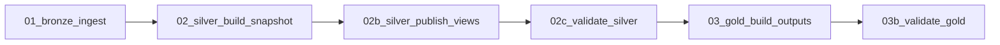

# ETAPA 4: Procesamiento, calidad y transformación

## Decisiones confirmadas

| Decisión | Resultado confirmado |
|---|---|
| Recurso canónico Silver | Tabla Delta `silver.listings_snapshot` |
| Grano canónico | `ingest_date + listing_id` |
| Idempotencia | `MERGE` que sincroniza la fecha completa del snapshot |
| Reejecuciones de Airflow en un día | Silver conserva solo la observación válida más reciente por anuncio y fecha |
| Errores de calidad | Tabla `silver.listings_quarantine` |
| Métricas de calidad | Tabla `silver.data_quality_results` por `run_id + rule_id` |
| Opciones de dormitorios | Vista estándar `silver.vw_listing_bedroom_options` |
| Vista materializada | No se usará inicialmente |

## Justificación de vistas

El ejemplo de Marketing usa una vista materializada para un perfil de clientes
que une ventas y calcula agregados costosos. En este Data Product, Bronze tiene
9,442 observaciones históricas y el snapshot más reciente tiene 3,335; el
volumen y la transformación `explode(sequence(...))` no justifican una vista
materializada ni su refresh administrado.

La vista estándar de opciones de dormitorios no almacena datos: refleja el
snapshot Silver y permite representar un proyecto de 1 a 3 dormitorios como
tres opciones analíticas. La tabla `listings_snapshot` sigue siendo la fuente
canónica persistente.

## Reglas de calidad implementadas

### Envían a cuarentena

- manifest inexistente o con estado distinto de `success`;
- `listing_id` o `_run_id` vacío;
- fecha de partición inválida;
- dormitorios fuera de 1 a 4, o rango invertido;
- inconsistencias entre dormitorios de la ruta y parámetros de búsqueda;
- precio o área no positivos cuando fueron interpretados.

### No envían a cuarentena

- precio o área no interpretables o ausentes: el anuncio sigue contando para
  métricas de oferta, pero no para métricas monetarias o de precio por m2.

## DAG del Job de Databricks

1. `01_bronze_ingest.py`: carga de manera incremental los archivos Raw de
   Airflow hacia las tablas Bronze mediante Auto Loader.
2. `02_silver_build_snapshot.py`: normaliza, valida, envía registros inválidos
   a cuarentena y sincroniza el snapshot con `MERGE`.
3. `02b_silver_publish_views.py`: crea o actualiza la vista estándar de
   opciones de dormitorios.
4. `02c_validate_silver.py`: comprueba unicidad, rango de dormitorios y
   trazabilidad a manifests exitosos. Solo las violaciones estructurales hacen
   fallar el Job.

Gold se ejecutará después de `02c_validate_silver.py` mediante:

5. `03_gold_build_outputs.py`: publica `market_daily_by_district`,
   `listing_latest` y `listing_change_daily`.
6. `03b_validate_gold.py`: valida los granos Gold y que `REMOVED` solo exista
   cuando los cuatro segmentos tengan manifests exitosos.

## Ejecución confirmada en Databricks

Gold fue ejecutado correctamente y publicó sus tres salidas Delta:

- `gold.market_daily_by_district`;
- `gold.listing_latest`;
- `gold.listing_change_daily`.

Los anuncios sin precio o moneda interpretable se agrupan bajo `currency =
UNKNOWN`. Se incluyen en los conteos de oferta, mientras que sus métricas
monetarias permanecen en `NULL`, según la política de monedas confirmada.

## Job Medallion confirmado

El Job `g101_cmc_mercado_alquiler_daily` fue ejecutado correctamente en
Databricks. Las seis tareas terminaron en estado **Succeeded**:

1. `bronze_ingest`;
2. `silver_build_snapshot`;
3. `silver_publish_views`;
4. `validate_silver`;
5. `gold_build_outputs`;
6. `validate_gold`.

La ejecución validada completó el flujo Bronze → Silver → Gold en
aproximadamente cinco minutos. El pipeline diario queda listo para ejecutarse
después de la publicación Raw de Airflow.

## Estado

Los tres notebooks Silver fueron importados y ejecutados correctamente en
Databricks:

1. `02_silver_build_snapshot.py`;
2. `02b_silver_publish_views.py`;
3. `02c_validate_silver.py`.

La siguiente etapa es construir las salidas Gold a partir de
`silver.listings_snapshot` y `silver.vw_listing_bedroom_options`.
