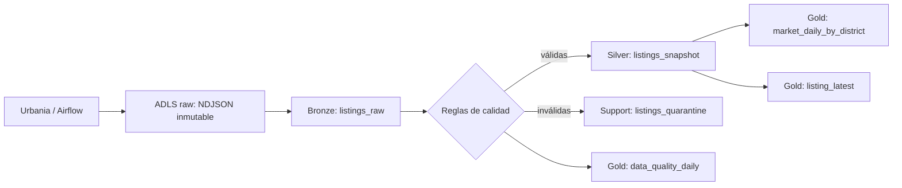
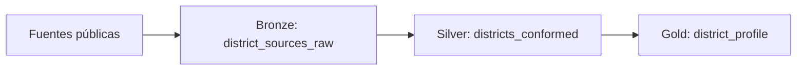
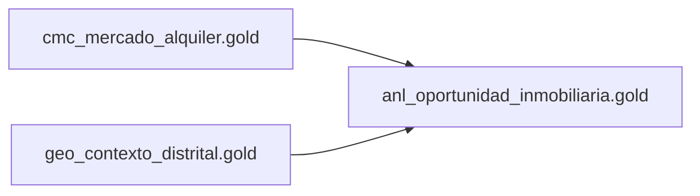
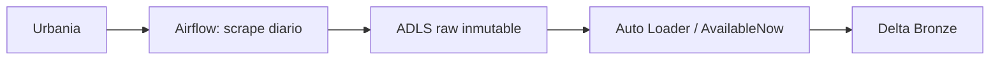
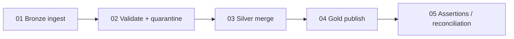

# Plan de adopción Data Mesh + Medallion para Urbania

## 0. Decisión de alcance

Para la entrega se recomienda implementar **un Data Product completo** y dejar dos productos adicionales como roadmap. Esto cumple el mínimo de la tarea y evita presentar como productos independientes varias tablas derivadas de la misma fuente y con el mismo owner.

El Data Product implementable con el código y los datos actuales es:

- **`g101_cmc_mercado_alquiler`**: inteligencia del mercado de alquiler de departamentos en Lima.

Roadmap opcional, si el tiempo permite incorporar más fuentes:

- **`g101_geo_contexto_distrital`**: contexto demográfico y geográfico por distrito.
- **`g101_anl_oportunidad_inmobiliaria`**: indicadores compuestos de oportunidad, consumidor de los Gold de los dos productos anteriores.

No se recomienda crear tres catálogos ahora y llenarlos con copias de Urbania. Un Data Product debe tener propósito, owner, contrato, calidad y consumidores propios; no es solamente una separación técnica de tablas.

### Diagnóstico del material existente

- El scraper y Airflow ya aterrizan NDJSON particionado en ADLS.
- Los notebooks actuales crean Bronze, Silver y Gold en un catálogo compartido (`g101_catalog`).
- Los datos locales contienen 3 archivos, 2,779 observaciones y 1,104 `listing_id` únicos. Los tres runs pertenecen al mismo día, por lo que Gold puede sobrecontar la oferta si agrega todas las observaciones.
- `config/parameters.py` selecciona solo el archivo más reciente. Si llegan dos archivos antes de ejecutar Databricks, los anteriores no se procesan.
- Bronze deduplica solo por `_run_id`. Si un run se escribió parcialmente, la reejecución puede omitir las filas faltantes.
- Bronze infiere el esquema y habilita `mergeSchema`; esto es evolución permisiva, no schema enforcement.
- Silver y Gold usan `overwrite`. El resultado es repetible para datasets pequeños, pero no es incremental ni conserva una política explícita de snapshots.

---

# ETAPA 1: Descubrimiento y definición de Data Products

## 1.1 Dominios

| Dominio | Prefijo | Responsabilidad | Owner propuesto |
|---|---|---|---|
| Comercial / Inteligencia de mercado | `cmc` | Oferta, precios y evolución del mercado de alquiler | Responsable de Inteligencia Comercial |
| Geografía / Datos maestros | `geo` | Dimensiones distritales, coordenadas y contexto público | Responsable de Data Governance |
| Analítica | `anl` | Indicadores compuestos para decisiones de inversión | Responsable de Analítica |

Para la entrega inicial solo se materializa el dominio `cmc`.

## 1.2 Necesidad y preguntas de negocio

**Problema:** la información de alquiler está dispersa y una foto aislada del portal no permite comparar distritos ni observar tendencias.

**Pregunta principal:** ¿cómo varían la oferta, el alquiler mensual y el precio por m2 de departamentos en Lima por distrito y fecha?

Preguntas secundarias:

1. ¿Qué distritos tienen mayor y menor precio mediano de alquiler?
2. ¿Dónde aumenta o disminuye la cantidad de avisos activos?
3. ¿Cuál es la distribución de precios por número de dormitorios?
4. ¿Qué avisos aparecen, desaparecen o cambian de precio entre snapshots?

**Stakeholders:** Comercial, Analítica, inversionistas o usuarios que comparan el mercado.

**Frecuencia:** diaria. Para la primera demostración puede ejecutarse bajo demanda.

**Acción habilitada:** comparar distritos, detectar cambios de oferta y priorizar análisis de oportunidades.

## 1.3 Data Product obligatorio

### Nombre

`g101_cmc_mercado_alquiler`

Convención: `<grupo>_<dominio>_<data_product>`.

### Owner y consumidores

- Domain owner: responsable de Inteligencia Comercial.
- Technical owner: Data Engineer del equipo G101.
- Consumidores: analistas, dashboards y futuros Data Products analíticos.

### Inputs

| Input | Tipo | Frecuencia | Clave / control |
|---|---|---|---|
| Urbania listings NDJSON en ADLS | Fuente externa, raw | Diaria | `_run_id`, `listing_id`, `_ingested_at`, `_metadata.file_path` |
| Parámetros de búsqueda | Metadata del scraper | Por run | `operation`, `property_type`, `location`, `bedrooms` |

### Outputs

| Output | Grano | Uso |
|---|---|---|
| `gold.market_daily_by_district` | fecha + distrito + moneda + dormitorios | Oferta y precios diarios por distrito |
| `gold.listing_latest` | un registro por `listing_id` | Estado más reciente de cada aviso |
| `gold.data_quality_daily` | fecha + regla | Evidencia de calidad y filas en cuarentena |

Para una entrega mínima puede presentarse solo `market_daily_by_district`; los otros outputs fortalecen la condición de producto reutilizable y observable.

### SLO y reglas de producto

- Freshness: datos Gold disponibles antes de las 09:00, máximo 24 horas después del scrape.
- Completitud: `listing_id`, `district`, `_ingested_at` y `_run_id` no nulos >= 99%.
- Unicidad Bronze: una fila por (`_run_id`, `listing_id`).
- Unicidad de snapshot diario Silver: una fila por (`ingest_date`, `listing_id`), tomando el run más reciente del día.
- Validez: `price_amount > 0`, `area_min_m2 > 0`, `area_max_m2 >= area_min_m2` cuando los campos existan.
- Trazabilidad: toda fila conserva archivo fuente, run, fecha de carga y parámetros de búsqueda.
- Reejecución: ejecutar dos veces el mismo input no cambia el conteo ni las métricas.

## 1.4 Diseño Medallion del DP obligatorio



Tablas por capa:

- `bronze.listings_raw`: payload crudo, schema explícito y metadata de ingesta.
- `silver.listings_snapshot`: tipos corregidos, moneda separada, precio y área numéricos, distrito normalizado y un snapshot por aviso/día.
- `support.listings_quarantine`: filas inválidas con `rule_id`, `reason`, `run_id` y payload.
- `gold.market_daily_by_district`: `listing_count`, mediana/promedio/mínimo/máximo de precio, mediana de precio por m2 y variación contra el día anterior.
- `gold.listing_latest`: última observación conocida de cada aviso.
- `gold.data_quality_daily`: total, válidas, inválidas y porcentaje por regla.

## 1.5 Roadmap de scraping y fuentes

### Prioridad 0: no se requiere scraping nuevo para aprobar el MVP

El dataset actual permite demostrar el DP para alquileres de departamentos de 2 dormitorios. Es indispensable recolectar varios días para que la dimensión temporal sea real.

### Prioridad 1: ampliar el mismo DP

Parametrizar Airflow para cubrir dormitorios `1`, `2`, `3` y `4+`, manteniendo una partición por `bedrooms`. Después ampliar `property_type` solo si la pregunta de negocio lo requiere. No crear un DAG copiado por combinación: usar dynamic task mapping o una lista de configuraciones.

### Prioridad 2: segundo Data Product opcional

`g101_geo_contexto_distrital` puede ingerir fuentes públicas estables:

- código UBIGEO y nombres oficiales de distritos;
- centroides o límites geográficos;
- población y hogares por distrito;
- opcionalmente indicadores de seguridad o accesibilidad.

Su Gold sería `gold.district_profile`, con una fila por distrito y periodo. Antes de implementarlo se debe confirmar licencia, periodicidad y método de descarga de cada fuente.



### Prioridad 3: producto compuesto opcional

`g101_anl_oportunidad_inmobiliaria` consume productos, no archivos raw:

- Input 1: `g101_cmc_mercado_alquiler.gold.market_daily_by_district`.
- Input 2: `g101_geo_contexto_distrital.gold.district_profile`.
- Output: `gold.rental_opportunity_by_district`.



---

# ETAPA 2: Infraestructura y configuración base

## 2.1 Prerrequisitos

1. Confirmar que el workspace usa Unity Catalog.
2. Confirmar un metastore asignado al workspace.
3. Obtener `CREATE CATALOG` sobre el metastore.
4. Confirmar una ubicación administrada por el metastore o una External Location sobre ADLS.
5. Usar un SQL Warehouse o compute compatible con Unity Catalog.
6. Crear grupos a nivel de cuenta, no grupos locales aislados del workspace.

## 2.2 Grupos del Data Product

Crear estos grupos:

- `g101_cmc_mercado_alquiler_admin`
- `g101_cmc_mercado_alquiler_writer`
- `g101_cmc_mercado_alquiler_reader`

### Paso a paso en la interfaz

Como Account Admin:

1. Abrir **Account Console**.
2. Ir a **User management > Groups**.
3. Crear los tres grupos anteriores o sincronizarlos desde Microsoft Entra ID.
4. Agregar los miembros correspondientes.
5. Asignar los grupos al workspace donde se ejecutará el pipeline.

Como Workspace Admin, si la identidad ya existe a nivel de cuenta:

1. En el workspace, abrir el menú del usuario y entrar a **Settings**.
2. Abrir **Identity and access**.
3. Junto a **Groups**, seleccionar **Manage**.
4. Verificar que los tres grupos están disponibles y tienen acceso al workspace.

## 2.3 Crear catálogo y esquemas en Catalog Explorer

1. En el workspace abrir **Catalog**.
2. Abrir **Catalogs** y hacer clic en **Create catalog**.
3. Elegir tipo **Standard**.
4. Nombre: `g101_cmc_mercado_alquiler`.
5. Seleccionar la Managed Storage Location si el metastore no tiene una por defecto.
6. Hacer clic en **Create** y luego **Configure catalog**.
7. En **Workspaces**, limitar el catálogo al workspace de la tarea si corresponde.
8. En **Permissions**, asignar ownership al grupo `..._admin`.
9. Añadir comentario y tags: `domain=cmc`, `data_product=mercado_alquiler`, `owner=g101`.
10. Dentro del catálogo crear los esquemas `bronze`, `silver`, `gold` y `support`.
11. Añadir comentarios de propósito en cada esquema.

El equivalente idempotente en SQL es:

```sql
CREATE CATALOG IF NOT EXISTS g101_cmc_mercado_alquiler
COMMENT 'Data Product del mercado de alquiler de Lima';

CREATE SCHEMA IF NOT EXISTS g101_cmc_mercado_alquiler.bronze
COMMENT 'Datos crudos e inmutables de las fuentes';
CREATE SCHEMA IF NOT EXISTS g101_cmc_mercado_alquiler.silver
COMMENT 'Snapshots limpios, tipados y validados';
CREATE SCHEMA IF NOT EXISTS g101_cmc_mercado_alquiler.gold
COMMENT 'Outputs de negocio publicados';
CREATE SCHEMA IF NOT EXISTS g101_cmc_mercado_alquiler.support
COMMENT 'Cuarentena, auditoría y controles operativos';

ALTER CATALOG g101_cmc_mercado_alquiler
OWNER TO `g101_cmc_mercado_alquiler_admin`;
```

No usar `DROP SCHEMA ... CASCADE` en el setup normal. El ejemplo de marketing lo hace para un laboratorio reiniciable, pero elimina datos y rompe la idempotencia operativa.

## 2.4 Grants de mínimo privilegio

```sql
-- Descubrimiento sin acceso al contenido
GRANT BROWSE ON CATALOG g101_cmc_mercado_alquiler TO `account users`;

-- Reader: solo outputs publicados
GRANT USE CATALOG ON CATALOG g101_cmc_mercado_alquiler
TO `g101_cmc_mercado_alquiler_reader`;
GRANT USE SCHEMA ON SCHEMA g101_cmc_mercado_alquiler.gold
TO `g101_cmc_mercado_alquiler_reader`;
GRANT SELECT ON SCHEMA g101_cmc_mercado_alquiler.gold
TO `g101_cmc_mercado_alquiler_reader`;

-- Writer: ejecución del pipeline en todas las capas
GRANT USE CATALOG ON CATALOG g101_cmc_mercado_alquiler
TO `g101_cmc_mercado_alquiler_writer`;
GRANT USE SCHEMA, CREATE TABLE, CREATE VOLUME
ON SCHEMA g101_cmc_mercado_alquiler.bronze
TO `g101_cmc_mercado_alquiler_writer`;
GRANT USE SCHEMA, CREATE TABLE
ON SCHEMA g101_cmc_mercado_alquiler.silver
TO `g101_cmc_mercado_alquiler_writer`;
GRANT USE SCHEMA, CREATE TABLE, CREATE VIEW, CREATE MATERIALIZED VIEW
ON SCHEMA g101_cmc_mercado_alquiler.gold
TO `g101_cmc_mercado_alquiler_writer`;
GRANT USE SCHEMA, CREATE TABLE
ON SCHEMA g101_cmc_mercado_alquiler.support
TO `g101_cmc_mercado_alquiler_writer`;
GRANT SELECT, MODIFY ON CATALOG g101_cmc_mercado_alquiler
TO `g101_cmc_mercado_alquiler_writer`;

-- Admin: gobierno del catálogo. Ownership ya da capacidades completas.
GRANT MANAGE ON CATALOG g101_cmc_mercado_alquiler
TO `g101_cmc_mercado_alquiler_admin`;
```

Validar con:

```sql
SHOW GRANTS ON CATALOG g101_cmc_mercado_alquiler;
SHOW GRANTS ON SCHEMA g101_cmc_mercado_alquiler.gold;
```

En un entorno más estricto, el Job debe ejecutarse con un Service Principal agregado al grupo writer, no con la identidad personal del desarrollador.

## 2.5 Tags y confidencialidad

Urbania no contiene PII de clientes. Aun así, aplicar clasificación:

- `source=urbania`
- `classification=public_web`
- `data_product=g101_cmc_mercado_alquiler`
- `quality_tier=gold|silver|bronze`

No etiquetar automáticamente dirección o publisher como PII sin una definición de gobierno aprobada. Si luego se incorporan datos personales, definir tags gobernados y políticas de máscara antes de publicar Gold.

---

# ETAPA 3: Ingesta y almacenamiento

## 3.1 Flujo objetivo



Airflow mantiene su responsabilidad de extracción y landing. Databricks asume ingestión incremental desde ADLS, calidad y transformación.

## 3.2 Cambios requeridos respecto al notebook actual

1. Leer el directorio base completo, no buscar el `.jsonl` más reciente.
2. Usar Auto Loader con un checkpoint estable y un `schemaLocation` por fuente.
3. Definir el esquema de Bronze de forma explícita. Campos inesperados van a `_rescued_data` o fallan según la política elegida.
4. Mantener los archivos raw inmutables; no sobrescribir el mismo nombre.
5. Registrar `_metadata.file_path`, `_metadata.file_modification_time` y `_bronze_loaded_at`.
6. Escribir en Delta con un checkpoint exclusivo para este stream.
7. Usar `trigger(availableNow=True)` para una ejecución finita diaria.

Rutas propuestas:

```text
Raw input:
abfss://datalake@stdemdsai.dfs.core.windows.net/raw/airflow/G1/source=urbania/

Schema state:
abfss://datalake@stdemdsai.dfs.core.windows.net/checkpoints/g101_cmc_mercado_alquiler/schema/urbania/

Stream checkpoint:
abfss://datalake@stdemdsai.dfs.core.windows.net/checkpoints/g101_cmc_mercado_alquiler/bronze/urbania/
```

No aplicar lifecycle deletion al checkpoint. Auto Loader depende de ese estado para conservar exactly-once a nivel de archivos.

## 3.3 Claves e idempotencia

Niveles de identidad:

- Archivo: `_metadata.file_path`.
- Ejecución del scraper: `_run_id`.
- Observación: (`_run_id`, `listing_id`).
- Snapshot diario publicado: (`ingest_date`, `listing_id`), conservando la observación con `_ingested_at` mayor.
- Estado actual: `listing_id`, conservando el snapshot más reciente.

Auto Loader evita reprocesar el mismo archivo con su checkpoint. Como defensa adicional, Bronze debe eliminar duplicados dentro del microbatch por (`_run_id`, `listing_id`) antes del write. Silver debe usar `MERGE` con una fuente previamente deduplicada; no debe hacer merge con varias filas que coincidan con la misma clave destino.

## 3.4 Contrato mínimo de Bronze

El contrato debe versionarse junto al código e incluir:

- nombre, tipo, nulabilidad y descripción de cada campo;
- claves `listing_id` y `_run_id`;
- formato UTC de `_ingested_at`;
- valores esperados de `operation`, `property_type` y `location`;
- política de nuevos campos: rescatar y alertar, no promover automáticamente a Silver;
- SLO de llegada y reglas de rechazo.

---

# ETAPA 4: Procesamiento, calidad y transformación

## 4.1 Secuencia del pipeline



Reglas recomendadas:

| Regla | Acción |
|---|---|
| `listing_id` o `_run_id` nulo | Cuarentena y excluir de Silver |
| `_ingested_at` inválido | Cuarentena y excluir de Silver |
| `district` nulo | Mantener en Silver con flag; excluir de agregación distrital |
| precio no parseable | Mantener con `price_valid=false`; no usar en métricas de precio |
| precio <= 0 | Cuarentena o flag según porcentaje |
| área <= 0 o máximo < mínimo | Cuarentena |
| duplicado (`run_id`, `listing_id`) | Conservar uno y registrar métrica |
| caída de filas > 50% frente al último run exitoso | Fallar el pipeline y alertar |

El notebook de validación del ejemplo de marketing es una referencia útil, pero deben corregirse dos patrones antes de reutilizarlo: insertar en cuarentena solo las filas inválidas y filtrar timestamps con `to_date(inserted_at)` en lugar de compararlos directamente con un `DATE`.

## 4.2 Estrategia idempotente por capa

- Bronze: Auto Loader + checkpoint; raw append-only; deduplicación de la clave de observación.
- Silver: `MERGE` por (`ingest_date`, `listing_id`), usando `row_number` para seleccionar la observación más reciente del día antes del merge.
- Gold diario: recomputar únicamente las fechas afectadas y usar `MERGE` por (`ingest_date`, `district`, `currency`, `bedrooms_bucket`), o `REPLACE WHERE` por fecha.
- Gold latest: `MERGE` por `listing_id` y actualizar solo si el source tiene `_ingested_at` mayor.
- Cuarentena y métricas: `MERGE` por (`run_id`, `listing_id`, `rule_id`) o borrar/reemplazar de forma atómica únicamente el `run_id` procesado.
- Job: `max concurrent runs = 1`. Los retries deben reutilizar el mismo input/checkpoint.

Prueba obligatoria de idempotencia:

1. Ejecutar el pipeline con un conjunto fijo de archivos.
2. Guardar conteos y checksums lógicos de Bronze/Silver/Gold.
3. Ejecutar de nuevo sin agregar archivos.
4. Verificar que no cambien conteos, claves ni métricas.
5. Agregar un archivo nuevo y verificar que solo entren sus observaciones y fechas afectadas.
6. Simular fallo después de Bronze, reparar la ejecución y verificar que no haya pérdida ni duplicados.

## 4.3 Crear el pipeline en Databricks Web

Para esta entrega, usar **Lakeflow Jobs** con notebooks encadenados. Es la opción más directa para adaptar el código existente. Lakeflow Spark Declarative Pipelines puede ser una segunda iteración si se desea expresar datasets y expectativas declarativamente.

### Importar código

1. En el workspace abrir **Workspace**.
2. Crear o abrir una Git folder vinculada al repositorio.
3. Confirmar que los notebooks de `databricks/` son visibles.
4. Crear un notebook de setup separado; ejecutarlo una vez para catálogo, schemas y objetos base.

### Crear el Job

1. Abrir **Jobs & Pipelines**.
2. Hacer clic en **Create > Job**.
3. Nombre: `g101_cmc_mercado_alquiler_daily`.
4. Crear tarea `01_bronze_ingest`, tipo **Notebook**, apuntando al notebook Bronze.
5. Seleccionar serverless o Jobs compute compatible con Unity Catalog.
6. Añadir `02_validate`, dependiente de `01_bronze_ingest`.
7. Añadir `03_silver_merge`, dependiente de `02_validate` y configurada para ejecutarse solo si la validación fue exitosa.
8. Añadir `04_gold_publish`, dependiente de `03_silver_merge`.
9. Añadir `05_assertions`, dependiente de `04_gold_publish`.
10. En Job parameters definir, como mínimo: `catalog`, `source_path` y opcionalmente `process_date`. No codificar un run ID fijo.
11. En cada Notebook task mapear parámetros a widgets si el notebook los usa.
12. En permisos del Job dar **Can manage** al grupo admin, **Can manage run** al writer y **Can view** al reader.
13. En Advanced settings configurar 2 retries con backoff, timeout y notificaciones de fallo.
14. Configurar **Maximum concurrent runs = 1**.
15. Ejecutar **Run now** y revisar el DAG, logs, conteos y tablas.
16. Al finalizar la prueba, añadir trigger diario después de que Airflow haya terminado de subir el archivo. Alternativamente usar file-arrival trigger si la External Location está preparada.

### Criterios de aceptación

- El catálogo tiene `bronze`, `silver`, `gold` y `support`.
- Reader no puede modificar datos y solo puede leer Gold.
- Writer puede ejecutar el pipeline sin ser owner del catálogo.
- La segunda ejecución con el mismo input produce cero filas nuevas y los mismos resultados.
- Las filas inválidas aparecen en cuarentena con una razón concreta.
- Gold no cuenta varias veces el mismo `listing_id` en el mismo día.
- `DESCRIBE HISTORY` evidencia transacciones Delta y permite auditar versiones.
- El Job muestra dependencias, retries, duración y estado de cada tarea.

---

# Orden recomendado de implementación

1. Renombrar el catálogo lógico y parametrizar todos los FQN.
2. Crear el notebook idempotente de setup y grants.
3. Sustituir la búsqueda del último archivo por Auto Loader sobre el directorio base.
4. Añadir contrato explícito de Bronze y `_rescued_data`.
5. Crear validaciones, tablas support y métricas.
6. Cambiar Silver a deduplicación diaria + `MERGE`.
7. Cambiar Gold para usar el snapshot diario deduplicado.
8. Crear el Lakeflow Job y ejecutar pruebas de idempotencia/fallo.
9. Recolectar al menos 7-14 días para demostrar tendencias.
10. Solo después decidir si se incorpora `geo_contexto_distrital`.

## Evidencias sugeridas para la entrega

- diagrama Mermaid de cada DP implementado;
- tabla de caso de uso, inputs, outputs, owner, consumidores y SLO;
- captura de Catalog Explorer con catálogo y schemas;
- captura de grupos y grants;
- captura del grafo y una ejecución exitosa del Job;
- consulta de conteos por capa;
- consulta de cuarentena y métricas de calidad;
- comparación de dos reejecuciones que demuestre idempotencia;
- `DESCRIBE HISTORY` de Bronze, Silver y Gold.

## Referencias oficiales

- [Crear catálogos en Azure Databricks](https://learn.microsoft.com/en-us/azure/databricks/catalogs/create-catalog)
- [Configurar Unity Catalog](https://learn.microsoft.com/en-us/azure/databricks/data-governance/unity-catalog/setup-uc)
- [Modelo de permisos de Unity Catalog](https://learn.microsoft.com/en-us/azure/databricks/data-governance/unity-catalog/access-control/permissions-concepts)
- [Administrar grupos](https://learn.microsoft.com/en-us/azure/databricks/admin/users-groups/manage-groups)
- [Auto Loader para producción](https://learn.microsoft.com/en-us/azure/databricks/ingestion/cloud-object-storage/auto-loader/production)
- [MERGE en Delta Lake](https://learn.microsoft.com/en-us/azure/databricks/delta/merge)
- [Expectations de calidad](https://learn.microsoft.com/en-us/azure/databricks/ldp/expectations)
- [Configurar Lakeflow Jobs](https://docs.databricks.com/aws/en/jobs/configure-job)

