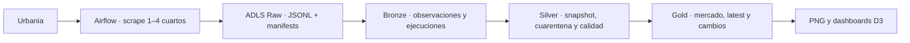

# Databricks — Data Product `cmc_mercado_alquiler`

Esta carpeta implementa la parte Databricks del Data Product de inteligencia del
mercado de alquiler residencial de Lima. Airflow extrae y publica archivos raw
inmutables en ADLS; Databricks los convierte en tablas Delta Bronze, Silver y
Gold gobernadas con Unity Catalog.

## Arquitectura



Principio de responsabilidad:

- **Airflow** extrae y aterriza archivos; no calcula métricas de negocio.
- **Bronze** conserva observaciones y metadatos de ejecución.
- **Silver** tipa, valida, deduplica y pone inválidos en cuarentena.
- **Gold** publica exclusivamente métricas listas para consumidores.
- **Visualizaciones** consumen únicamente el contrato exportado desde Gold.

## Objetos publicados

Catálogo:

```text
g101_cmc_mercado_alquiler
```

| Capa | Objeto | Propósito |
|---|---|---|
| Bronze | `bronze.listings_raw` | Observaciones raw con lineage y clave idempotente. |
| Bronze | `bronze.ingestion_runs` | Manifests, estado, páginas y registros por ejecución. |
| Silver | `silver.listings_snapshot` | Una observación canónica por fecha y listing. |
| Silver | `silver.listings_quarantine` | Registros rechazados con regla y motivo. |
| Silver | `silver.data_quality_results` | Resultados auditables de controles de calidad. |
| Silver | `silver.vw_listing_bedroom_options` | Expansión gobernada de rangos de dormitorios. |
| Gold | `gold.market_daily_by_district` | Mercado por fecha, distrito, cuartos y moneda. |
| Gold | `gold.listing_latest` | Último estado conocido de cada listing. |
| Gold | `gold.listing_change_daily` | Altas, bajas y cambios entre snapshots. |

## Prerrequisitos

1. Unity Catalog habilitado.
2. Catálogo `g101_cmc_mercado_alquiler` con schemas `bronze`, `silver`, `gold`
   y `support`.
3. Usuario o Service Principal dentro del grupo writer del Data Product.
4. Acceso de lectura al raw path en ADLS.
5. Compute de Databricks compatible con Unity Catalog.
6. Airflow debe haber publicado al menos un conjunto de JSONL y manifests
   exitosos.

La creación de catálogo, schemas y grupos se realiza en Databricks Web. El
notebook `00_validate_infrastructure.py` solo valida que la infraestructura
esperada exista; no ejecuta cambios destructivos.

## Parámetros

Todos los notebooks cargan `config/parameters.py`, que expone widgets para
ejecución manual o mediante Lakeflow Jobs:

| Widget | Valor por defecto | Uso |
|---|---|---|
| `catalog` | `g101_cmc_mercado_alquiler` | Catálogo Unity Catalog del Data Product. |
| `raw_source_path` | Ruta ADLS de Urbania | Directorio base de JSONL y manifests. |
| `checkpoint_root` | Ruta ADLS de checkpoints | Schemas y estado incremental de Auto Loader. |
| `processing_date` | vacío | Vacío procesa la fecha exitosa más reciente; acepta `YYYY-MM-DD`. |

No borres ni apliques lifecycle deletion a `checkpoint_root`: ese estado evita
reprocesar archivos ya consumidos.

## Orden de ejecución

### Validación inicial manual

Ejecuta una vez:

```text
00_validate_infrastructure.py
```

### Job diario

Configura un Lakeflow Job llamado `g101_cmc_mercado_alquiler_daily` con estas
tareas y dependencias:

| Orden | Tarea | Notebook | Depende de |
|---:|---|---|---|
| 1 | `bronze_ingest` | `01_bronze_ingest.py` | — |
| 2 | `silver_build_snapshot` | `02_silver_build_snapshot.py` | `bronze_ingest` |
| 3 | `silver_publish_views` | `02b_silver_publish_views.py` | `silver_build_snapshot` |
| 4 | `validate_silver` | `02c_validate_silver.py` | `silver_publish_views` |
| 5 | `gold_build_outputs` | `03_gold_build_outputs.py` | `validate_silver` |
| 6 | `validate_gold` | `03b_validate_gold.py` | `gold_build_outputs` |

Configura **Maximum concurrent runs = 1**. En las tareas 2, 4, 5 y 6 agrega el
widget `processing_date`; déjalo vacío en la operación normal.

`01_bronze_ingest.py` usa Auto Loader con `availableNow=True`: emplea la
semántica incremental y el checkpoint de Structured Streaming, pero cada
ejecución del Job es finita y termina después de consumir los archivos
disponibles.

La configuración detallada del Job está en
[`cmc_mercado_alquiler/SILVER_JOB_SETUP.md`](cmc_mercado_alquiler/SILVER_JOB_SETUP.md).

## Idempotencia

La solución aplica defensas complementarias:

- raw es append-only y Airflow no sobrescribe blobs existentes;
- Auto Loader registra archivos procesados en checkpoints estables;
- Bronze calcula claves determinísticas y usa `MERGE` insert-only;
- Silver selecciona una fila canónica por `ingest_date + listing_id`;
- Silver y Gold reemplazan o sincronizan únicamente la fecha procesada;
- el Job admite una sola ejecución concurrente;
- reintentos reutilizan los mismos inputs y parámetros.

Prueba recomendada:

1. Ejecutar el Job con un conjunto fijo de archivos.
2. Guardar conteos por capa y fecha.
3. Ejecutarlo nuevamente sin agregar archivos.
4. Confirmar que no cambien conteos, claves ni métricas Gold.

## Calidad

Silver controla, entre otros:

- claves y fechas obligatorias;
- dormitorios dentro del rango 1–4;
- consistencia de rangos de área y dormitorios;
- precio y área positivos cuando son utilizables;
- duplicados por fecha y listing;
- correspondencia entre parámetros de búsqueda y partición.

Los inválidos se excluyen del snapshot publicado y se registran en cuarentena
con una regla concreta. `02c_validate_silver.py` y `03b_validate_gold.py` fallan
el Job cuando se rompe una aserción crítica.

## Exportación para visualizaciones

Ejecuta [`cmc_mercado_alquiler/04_visualization_export.sql`](cmc_mercado_alquiler/04_visualization_export.sql)
después de una ejecución Gold exitosa. El resultado contiene una sola fecha y
el contrato completo:

```text
ingest_date, district, bedrooms, currency, listing_count,
avg_price, median_price, min_price, max_price, avg_area_m2,
median_price_per_m2, new_listing_count, removed_listing_count,
price_changed_count, offer_change_pct, calculated_at
```

Guarda el CSV como:

```text
scripts/gold_visualization_full_export.csv
```

Los comandos y fuentes geográficas se documentan en
[`../docs/LIMA_BUBBLE_MAP.md`](../docs/LIMA_BUBBLE_MAP.md).

## Estructura

```text
databricks/
├── README.md
├── PLAN_DATA_MESH.md
├── ETAPA_1_CONFIRMACIONES.md
├── ETAPA_2_CONFIRMACIONES.md
├── ETAPA_3_CONFIRMACIONES.md
├── ETAPA_4_CONFIRMACIONES.md
└── cmc_mercado_alquiler/
    ├── config/parameters.py
    ├── 00_validate_infrastructure.py
    ├── 01_bronze_ingest.py
    ├── 02_silver_build_snapshot.py
    ├── 02b_silver_publish_views.py
    ├── 02c_validate_silver.py
    ├── 03_gold_build_outputs.py
    ├── 03b_validate_gold.py
    ├── 04_visualization_export.sql
    └── SILVER_JOB_SETUP.md
```

## Evidencias de la entrega

- [`PLAN_DATA_MESH.md`](PLAN_DATA_MESH.md): diseño y decisiones de arquitectura.
- `ETAPA_*_CONFIRMACIONES.md`: acuerdos confirmados en cada etapa.
- Ejecución verde del Lakeflow Job: evidencia operativa Bronze → Gold.
- `reports/`: resultados estáticos e interactivos del contrato Gold.

